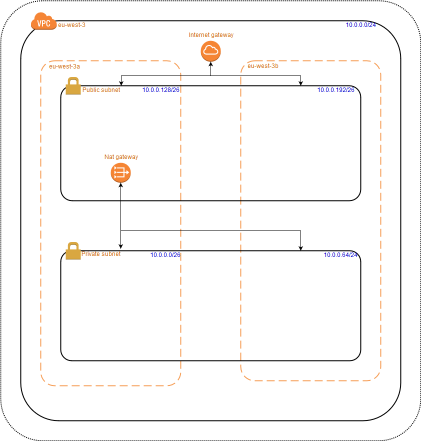

# Project to use for create all the SensorGraph infrastructure

## How to create/destroy the infrastructure

### 1. Initialise you environmernt

```shell
aws configure
```

### 2. Create the infrastructure

```shell
terraform apply
```

### 3. Destroy the infrastructure

```shell
terraform destroy
```

## Inputs

| Name | Description | Type | Default | Required |
|------|-------------|:----:|:-----:|:-----:|
| availability\_zones | By default we use only 2 AZs on Paris | list | `[ "eu-west-3a", "eu-west-3b", "eu-west-3c" ]` | no |
| aws\_region | Region to use for create the infrastructure (default: Paris) | string | `"eu-west-3"` | no |
| name | Default tags name to be applied on the infrastructure for the resources names| map | `...` | no |
| tags | Default tags to be applied on the infrastructure | map | `...` | no |
| vpc\_cidr | IP range to use on the VPC (default: 256 IPs) | string | `"10.0.0.0/23"` | no |

## Outputs

| Name | Description |
|------|-------------|
| region | The main region |
| availability\_zones | The AZs to be used on the infrastructure |
| bucket\_name\_accesslog\_bucket  | Bucket to use for logging the acceslogs for the others Bucket |
| private\_subnet\_id | The IDs of private subnets |
| private\_subnet\_cidr | The both IPs range used in the private subnet |
| public\_subnet\_id | The IDs of public subnets |
| public\_subnet\_cidr | The both IPs range useds in the public subnet |
| vpc\_id | The ID of main VPC |

## AWS architecture diagram

Use this file [files/drawio/infra.xml](files/drawio/infra.xml) on this site [https://www.draw.io](https://www.draw.io) if you need to contribute to the diagram.



> Note: The `NAT Gateway` is not yet implemented

## Author

* [**Mohamed BASRI**](https://github.com/mbasri)

## License

This project is licensed under the MIT License - see the [LICENSE](./LICENSE) file for details
